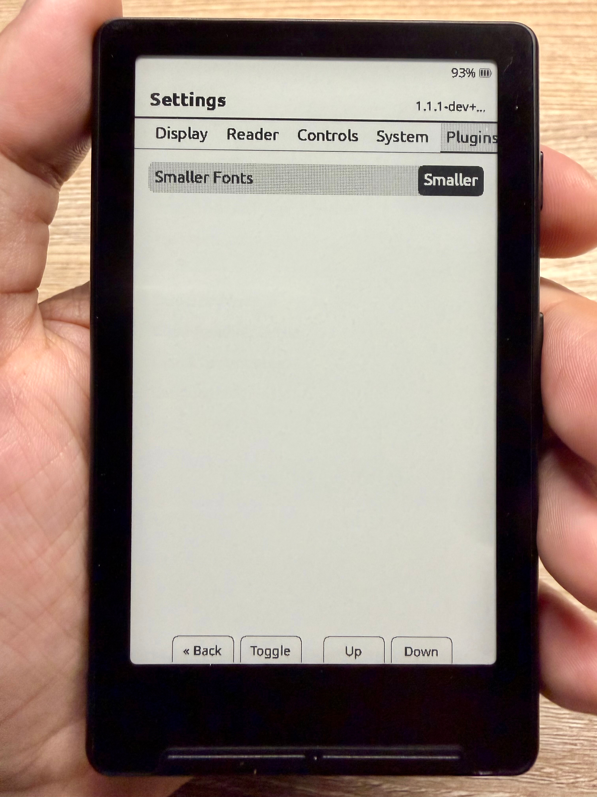

# xteink-plugins

A plugin system for customizing and extending [CrossPoint Reader](https://github.com/crosspoint-reader/crosspoint-reader) firmware on your xteink device. Plugins are applied as source-level patches before the firmware is compiled and flashed.

## Plugins

### Smaller Fonts

Adds a **Plugins** settings tab to CrossPoint with a "Smaller Fonts" option. When enabled, your chosen reader font is transparently substituted with a smaller variant — no need to change your font preference.

| Mode | Effect |
|------|--------|
| **Disabled** | No change (default) |
| **Smaller** | Drops the current font size down by one step (e.g. Bookerly 16 → 14) |
| **Smallest** | Drops the current font size down by two steps (e.g. Bookerly 16 → 12) |

Supports Bookerly, Noto Sans, and OpenDyslexic. The plugin also generates and embeds Bookerly at 8pt and 10pt — sizes not included in the stock firmware.

## Requirements

- Python 3.10+
- [PlatformIO](https://platformio.org/) (`pio` on your PATH)
- `git`
- Your xteink device connected via USB

## Usage

From the root of this repository, run:

```bash
python install.py
```

The installer will:

1. Clone the CrossPoint Reader source repository
2. Prompt you to select which plugins to install and apply them as patches
3. Build the firmware with PlatformIO
4. Auto-detect your device's serial port and flash the firmware

> **Note:** This script modifies and flashes custom firmware to your device. The author accepts no responsibility for any damage that may occur to your device as a result of using this installer.

## Repository Structure

```
xteink-plugins/
├── install.py              # Interactive installer: clone → patch → build → flash
└── plugins/
    └── smallerfonts/
        ├── patch.py                        # Patch script applied to the CrossPoint source
        ├── SmallerFontsPlugin.h/.cpp       # Font resolution logic
        └── SmallerFontsSettingsPage.h/.cpp # Settings UI activity
```

## Adding a Plugin

1. Create a new directory under `plugins/` with your plugin's name.
2. Add a `patch.py` file with a `patch(repo_dir: str)` function. This function receives the absolute path to the cloned CrossPoint repository and should make all necessary modifications.

The installer will automatically discover and offer to install any directory under `plugins/` that contains a `patch.py`.
