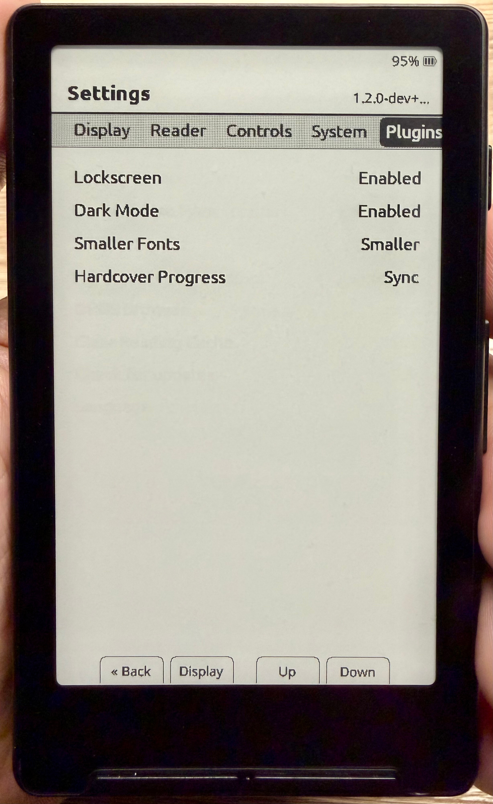
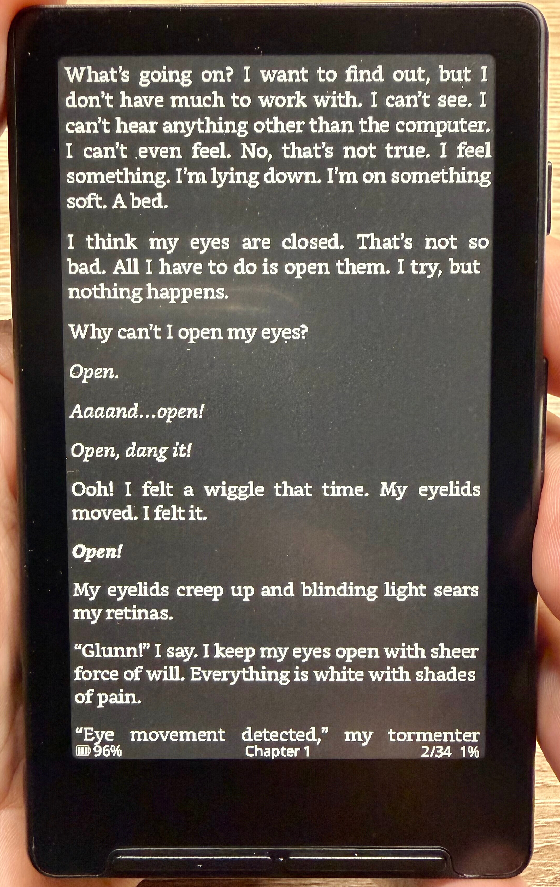

<table>
  <tr>
    <td></td>
    <td></td>
  </tr>
</table>

# xteink-plugins

A plugin system for customizing and extending [CrossPoint Reader](https://github.com/crosspoint-reader/crosspoint-reader) firmware on your xteink device. Plugins are applied as source-level patches before the firmware is compiled and flashed.

## Plugins

### Dark Mode

Adds a **Dark Mode** option to the Plugins settings tab and the web interface Settings page. When enabled, the screen is inverted after each page render, producing white-on-black text across all reader formats (EPUB, TXT, and XTC).

| State | Effect |
|-------|--------|
| **Disabled** | Normal display (default) |
| **Enabled** | Screen inverted — white text on black background |

### Smaller Fonts

Adds a **Smaller Fonts** option to the Plugins settings tab and the web interface Settings page. When enabled, your chosen reader font is transparently substituted with a smaller variant — no need to change your font preference.

| Mode | Effect |
|------|--------|
| **Disabled** | No change (default) |
| **Smaller** | Drops the current font size down by one step (e.g. Bookerly 16 → 14) |
| **Smallest** | Drops the current font size down by two steps (e.g. Bookerly 16 → 12) |

Supports Bookerly, Noto Sans, and OpenDyslexic. The plugin also generates and embeds Bookerly at 8pt and 10pt — sizes not included in the stock firmware.

## Requirements

- Python 3.10+
- [PlatformIO](https://platformio.org/) (`pio` on your PATH)
- `git`
- Your xteink device connected via USB

Install Python dependencies with:

```bash
pip3 install -r requirements.txt
```

## Usage

From the root of this repository, run:

```bash
python3 install.py
```

To auto-accept all plugin prompts, pass `--yes` (or `-y`):

```bash
python3 install.py --yes
```

By default this uses the `default` build environment. To use a different environment pass `-e`:

```bash
python3 install.py -e slim
python3 install.py -e gh_release
```

Flags can be combined:

```bash
python3 install.py --yes -e gh_release
```

| Environment | Description |
|-------------|-------------|
| `default` | Debug logging enabled, version from current git branch (recommended) |
| `gh_release` | Info logging only, version hardcoded to release tag |
| `slim` | No serial logging, smallest binary size |

The installer will:

1. Clone the CrossPoint Reader source repository
2. Prompt you to select which plugins to install and apply them as patches
3. Build the firmware with PlatformIO
4. Auto-detect your device's serial port and flash the firmware

> **Note:** This script modifies and flashes custom firmware to your device. The author accepts no responsibility for any damage that may occur to your device as a result of using this installer.

## Repository Structure

```
xteink-plugins/
├── install.py              # Interactive installer: clone → patch → build → flash
└── plugins/
    ├── darkmode/
    │   ├── patch.py                      # Patch script applied to the CrossPoint source
    │   ├── DarkModePlugin.h/.cpp         # Dark mode state and screen inversion logic
    │   └── DarkModeSettingsPage.h/.cpp   # Settings UI activity
    └── smallerfonts/
        ├── patch.py                        # Patch script applied to the CrossPoint source
        ├── SmallerFontsPlugin.h/.cpp       # Font resolution logic
        └── SmallerFontsSettingsPage.h/.cpp # Settings UI activity
```

## Troubleshooting

### Linux: Permission denied when flashing

If you see an error like `Could not open /dev/ttyACM0, the port is busy or doesn't exist` or `Permission denied`, your user needs to be added to the `dialout` group:

```bash
sudo usermod -aG dialout $USER
```

Log out and log back in for the change to take effect, then re-run `install.py`.

### Windows: 'pio' is not recognized

If you see `'pio' is not recognized as an internal or external command`, PlatformIO is not on your PATH. Run the following in PowerShell to add it:

```powershell
$env:PATH += ";$env:USERPROFILE\.platformio\penv\Scripts"
[Environment]::SetEnvironmentVariable("PATH", $env:PATH, "User")
```

If you installed Python from the Microsoft Store, the scripts folder is in a different location. Run this instead to find and add it:

```powershell
$scripts = (Get-ChildItem "$env:USERPROFILE\AppData\Local\Packages" -Filter "Scripts" -Recurse -ErrorAction SilentlyContinue | Where-Object { $_.FullName -like "*Python*" } | Select-Object -First 1).FullName
$env:PATH += ";$scripts"
[Environment]::SetEnvironmentVariable("PATH", $env:PATH, "User")
```

Restart your terminal and re-run `install.py`.

## Adding a Plugin

1. Create a new directory under `plugins/` with your plugin's name.
2. Add a `patch.py` file with a `patch(repo_dir: str)` function. This function receives the absolute path to the cloned CrossPoint repository and should make all necessary modifications.

The installer will automatically discover and offer to install any directory under `plugins/` that contains a `patch.py`.
